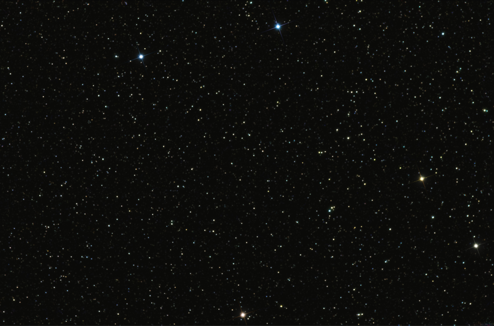
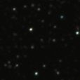
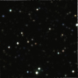
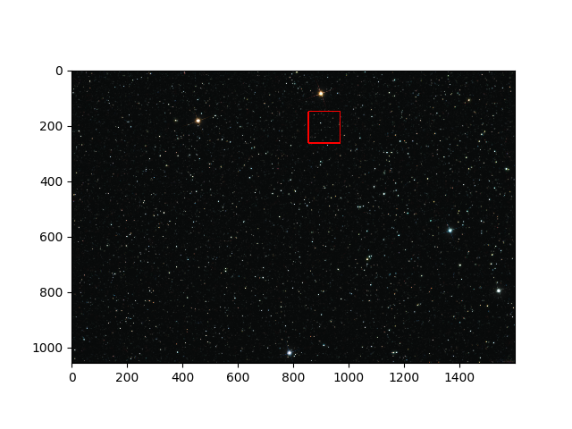
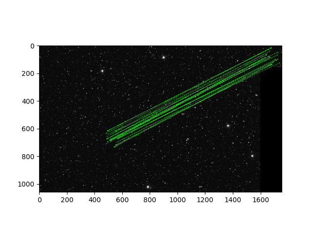

# Starmap_Project

# Locating a Defined Area in the Star Map
## The Goal of the Project
The task is define a location for cropped images from the star map.

### 1)Original Image of Star Map
 
### 2)Small Area

### 2)Rotated Small Area

## Detection results of cropped images on the star map
### Result for Cropped Image

### Result for Rotated and Cropped Image

